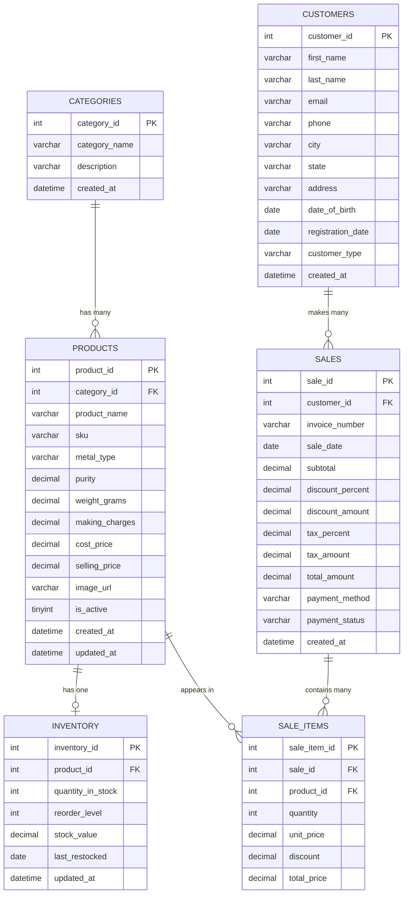

# 🗄️ Database Schema — Jewelry Business Intelligence System

> Complete database design with table definitions, relationships, data types, and constraints.

---

## 📐 Entity Relationship Overview

---

## 📋 Table Definitions

### 1. `categories`

Stores jewelry product categories.

| Column | Type | Constraints | Description |
|--------|------|-------------|-------------|
| `category_id` | INT | PK, AUTO_INCREMENT | Unique category identifier |
| `category_name` | VARCHAR(100) | NOT NULL, UNIQUE | Category name |
| `description` | TEXT | NULL | Category description |
| `created_at` | DATETIME | DEFAULT CURRENT_TIMESTAMP | Record creation time |

**Sample Data:**

| category_id | category_name | description |
|-------------|---------------|-------------|
| 1 | Rings | Gold, diamond & gemstone rings |
| 2 | Necklaces | Chains, pendants & necklace sets |
| 3 | Bangles | Gold & diamond bangles |
| 4 | Earrings | Studs, drops & jhumkas |
| 5 | Bracelets | Gold & platinum bracelets |
| 6 | Mangalsutra | Traditional mangalsutra designs |
| 7 | Nose Pins | Gold & diamond nose pins |
| 8 | Anklets | Gold & silver anklets |

---

### 2. `products`

Master product catalog for all jewelry items.

| Column | Type | Constraints | Description |
|--------|------|-------------|-------------|
| `product_id` | INT | PK, AUTO_INCREMENT | Unique product identifier |
| `category_id` | INT | FK → categories | Product category |
| `product_name` | VARCHAR(200) | NOT NULL | Product display name |
| `sku` | VARCHAR(50) | NOT NULL, UNIQUE | Stock Keeping Unit code |
| `metal_type` | VARCHAR(50) | NOT NULL | Gold/Silver/Platinum/Diamond |
| `purity` | DECIMAL(5,2) | NULL | Metal purity (e.g., 22K = 91.67%) |
| `weight_grams` | DECIMAL(10,3) | NOT NULL | Product weight in grams |
| `making_charges` | DECIMAL(10,2) | DEFAULT 0 | Manufacturing charges |
| `cost_price` | DECIMAL(12,2) | NOT NULL | Purchase/cost price |
| `selling_price` | DECIMAL(12,2) | NOT NULL | Retail selling price |
| `image_url` | VARCHAR(500) | NULL | Product image path |
| `is_active` | TINYINT(1) | DEFAULT 1 | Active/Inactive status |
| `created_at` | DATETIME | DEFAULT CURRENT_TIMESTAMP | Record creation time |
| `updated_at` | DATETIME | ON UPDATE CURRENT_TIMESTAMP | Last update time |

**Indexes:**
- `idx_category` on `category_id`
- `idx_metal_type` on `metal_type`
- `idx_sku` on `sku` (UNIQUE)

---

### 3. `inventory`

Tracks current stock levels for each product.

| Column | Type | Constraints | Description |
|--------|------|-------------|-------------|
| `inventory_id` | INT | PK, AUTO_INCREMENT | Unique inventory record ID |
| `product_id` | INT | FK → products, UNIQUE | Linked product |
| `quantity_in_stock` | INT | NOT NULL, DEFAULT 0 | Current stock count |
| `reorder_level` | INT | DEFAULT 5 | Minimum stock trigger level |
| `stock_value` | DECIMAL(14,2) | GENERATED | quantity × selling_price |
| `last_restocked` | DATE | NULL | Last restock date |
| `updated_at` | DATETIME | ON UPDATE CURRENT_TIMESTAMP | Last update time |

**Indexes:**
- `idx_product` on `product_id` (UNIQUE)
- `idx_low_stock` on `quantity_in_stock`

---

### 4. `customers`

Customer information and demographics.

| Column | Type | Constraints | Description |
|--------|------|-------------|-------------|
| `customer_id` | INT | PK, AUTO_INCREMENT | Unique customer identifier |
| `first_name` | VARCHAR(100) | NOT NULL | Customer first name |
| `last_name` | VARCHAR(100) | NOT NULL | Customer last name |
| `email` | VARCHAR(200) | UNIQUE, NULL | Email address |
| `phone` | VARCHAR(15) | NOT NULL | Phone number |
| `city` | VARCHAR(100) | NULL | City |
| `state` | VARCHAR(100) | NULL | State |
| `address` | TEXT | NULL | Full address |
| `date_of_birth` | DATE | NULL | Date of birth |
| `registration_date` | DATE | NOT NULL | When customer registered |
| `customer_type` | ENUM('Regular','Premium','VIP') | DEFAULT 'Regular' | Customer tier |
| `created_at` | DATETIME | DEFAULT CURRENT_TIMESTAMP | Record creation time |

**Indexes:**
- `idx_city` on `city`
- `idx_customer_type` on `customer_type`
- `idx_phone` on `phone`

---

### 5. `sales`

Sales transaction headers.

| Column | Type | Constraints | Description |
|--------|------|-------------|-------------|
| `sale_id` | INT | PK, AUTO_INCREMENT | Unique sale identifier |
| `customer_id` | INT | FK → customers | Purchasing customer |
| `invoice_number` | VARCHAR(50) | NOT NULL, UNIQUE | Invoice reference number |
| `sale_date` | DATE | NOT NULL | Date of sale |
| `subtotal` | DECIMAL(14,2) | NOT NULL | Pre-discount/tax total |
| `discount_percent` | DECIMAL(5,2) | DEFAULT 0 | Discount percentage |
| `discount_amount` | DECIMAL(12,2) | DEFAULT 0 | Discount in rupees |
| `tax_percent` | DECIMAL(5,2) | DEFAULT 3.00 | GST percentage |
| `tax_amount` | DECIMAL(12,2) | DEFAULT 0 | Tax in rupees |
| `total_amount` | DECIMAL(14,2) | NOT NULL | Final payable amount |
| `payment_method` | ENUM('Cash','Card','UPI','Bank Transfer','EMI') | NOT NULL | Payment mode |
| `payment_status` | ENUM('Paid','Pending','Partial') | DEFAULT 'Paid' | Payment status |
| `created_at` | DATETIME | DEFAULT CURRENT_TIMESTAMP | Record creation time |

**Indexes:**
- `idx_customer` on `customer_id`
- `idx_sale_date` on `sale_date`
- `idx_invoice` on `invoice_number` (UNIQUE)

---

### 6. `sale_items`

Individual line items within each sale.

| Column | Type | Constraints | Description |
|--------|------|-------------|-------------|
| `sale_item_id` | INT | PK, AUTO_INCREMENT | Unique line item ID |
| `sale_id` | INT | FK → sales | Parent sale |
| `product_id` | INT | FK → products | Sold product |
| `quantity` | INT | NOT NULL, DEFAULT 1 | Quantity sold |
| `unit_price` | DECIMAL(12,2) | NOT NULL | Price per unit at time of sale |
| `discount` | DECIMAL(10,2) | DEFAULT 0 | Item-level discount |
| `total_price` | DECIMAL(14,2) | NOT NULL | Line item total |

**Indexes:**
- `idx_sale` on `sale_id`
- `idx_product` on `product_id`

---

## 🔗 Foreign Key Relationships

| Child Table | Column | Parent Table | Column | On Delete |
|-------------|--------|--------------|--------|-----------|
| `products` | `category_id` | `categories` | `category_id` | RESTRICT |
| `inventory` | `product_id` | `products` | `product_id` | CASCADE |
| `sales` | `customer_id` | `customers` | `customer_id` | RESTRICT |
| `sale_items` | `sale_id` | `sales` | `sale_id` | CASCADE |
| `sale_items` | `product_id` | `products` | `product_id` | RESTRICT |

---

## 📊 Key Views (for Dashboard Queries)

### `v_sales_summary`
Aggregated sales data by month/year for trend analysis.

### `v_inventory_status`
Joined products + inventory with status flags (Low Stock, Overstock, Dead Stock).

### `v_customer_value`
Customer lifetime value calculations with total spend, order count, and average order value.

### `v_product_performance`
Product-level sales performance with units sold, revenue generated, and rank.

---

## 🔧 Data Mapping from Excel Files

| Excel File | Maps To | Key Columns |
|------------|---------|-------------|
| `Dummy_Jewellery_Inventory.xlsx` | `products`, `inventory`, `categories` | Product name, SKU, metal type, weight, price, stock qty |
| `Jaipur_Focused_Customer_Report.xlsx` | `customers` | Name, phone, city, registration date, customer type |
| `Jewellery_Sales_Report_2024_2026_Sorted.xlsx` | `sales`, `sale_items` | Invoice no, date, customer, product, qty, amount |

---

## ⚡ Performance Considerations

- **Indexes** are placed on all foreign keys and frequently queried columns
- **Date columns** are indexed for time-range queries in analytics
- **Composite indexes** can be added as query patterns are optimized
- **Views** pre-compute common aggregations for dashboard performance
