# 📐 System Design Document

## Jewelry Business Intelligence System using ERP Data

**Project Type:** BCA Final Year Project
**Academic Year:** 2024–2026

---

## Table of Contents

1. [System Overview](#1-system-overview)
2. [Feasibility Study](#2-feasibility-study)
3. [System Requirements](#3-system-requirements)
4. [System Architecture](#4-system-architecture)
5. [Data Flow Diagrams (DFD)](#5-data-flow-diagrams-dfd)
6. [Entity Relationship Diagram (ER Diagram)](#6-entity-relationship-diagram)
7. [Use Case Diagram](#7-use-case-diagram)
8. [Activity Diagrams](#8-activity-diagrams)
9. [Sequence Diagrams](#9-sequence-diagrams)
10. [Database Design](#10-database-design)
11. [Input Design](#11-input-design)
12. [Output Design](#12-output-design)
13. [User Interface Design](#13-user-interface-design)
14. [Security Design](#14-security-design)
15. [Testing Strategy](#15-testing-strategy)

---

## 1. System Overview

### 1.1 Purpose

The Jewelry Business Intelligence System is designed to transform raw ERP data from jewelry businesses into actionable business insights. The system provides interactive dashboards, sales analytics, inventory intelligence, customer analytics, and demand prediction capabilities.

### 1.2 Scope

The system processes pre-existing business data (dummy datasets for academic purposes) and does **not** perform direct billing or transaction processing. It acts as an analytical layer on top of ERP-generated data.

### 1.3 System Boundary

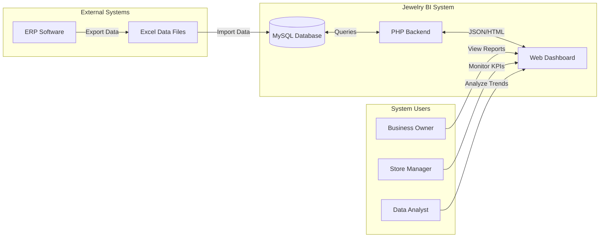

---

## 2. Feasibility Study

### 2.1 Technical Feasibility

| Criteria | Assessment | Status |
|----------|-----------|--------|
| Hardware availability | Standard PC/Laptop with 4GB+ RAM | ✅ Feasible |
| Software availability | All tools are free & open-source | ✅ Feasible |
| Technical expertise | HTML, CSS, JS, PHP, MySQL — BCA curriculum | ✅ Feasible |
| Development time | 3–4 months development cycle | ✅ Feasible |
| Internet requirement | Only for CDN libraries (Chart.js, Bootstrap) | ✅ Feasible |

### 2.2 Economic Feasibility

| Item | Cost |
|------|------|
| Development Tools (VS Code, DDEV, Git) | ₹0 (Free/Open-Source) |
| Server (Local Development via DDEV/Docker) | ₹0 |
| Database (MySQL via DDEV) | ₹0 |
| Libraries (Bootstrap, Chart.js) | ₹0 (Open-Source) |
| Domain & Hosting (if deployed) | ₹500–₹2000/year |
| **Total Estimated Cost** | **₹0 – ₹2000** |

### 2.3 Operational Feasibility

- The system uses a **web-based interface** accessible from any modern browser
- No special training required — intuitive dashboard design
- Uses standard web technologies familiar to users
- Can be operated on existing business hardware
- Minimal maintenance required once deployed

### 2.4 Schedule Feasibility

| Phase | Duration | Activities |
|-------|----------|------------|
| Phase 1: Planning & Analysis | 2 weeks | Requirements gathering, feasibility study |
| Phase 2: System Design | 2 weeks | ER diagrams, DFDs, UI mockups |
| Phase 3: Database Development | 1 week | Schema creation, data import |
| Phase 4: Backend Development | 3 weeks | PHP APIs, business logic |
| Phase 5: Frontend Development | 3 weeks | Dashboard UI, charts, interactivity |
| Phase 6: Testing & Debugging | 2 weeks | Unit testing, integration testing |
| Phase 7: Documentation | 1 week | Project report, user manual |
| **Total** | **~14 weeks** | |

---

## 3. System Requirements

### 3.1 Hardware Requirements

#### Development Environment

| Component | Minimum | Recommended |
|-----------|---------|-------------|
| Processor | Intel i3 / AMD Ryzen 3 | Intel i5 / AMD Ryzen 5 |
| RAM | 4 GB | 8 GB |
| Storage | 10 GB free space | 20 GB free space |
| Display | 1366 × 768 | 1920 × 1080 |
| Network | Not required (local dev) | Broadband for CDN |

#### Client (End User)

| Component | Minimum |
|-----------|---------|
| Any device with modern web browser | Chrome 90+, Firefox 88+, Edge 90+ |
| Screen resolution | 1024 × 768 |
| Network | LAN/Internet access to server |

### 3.2 Software Requirements

#### Development

| Software | Version | Purpose |
|----------|---------|---------|
| Operating System | Windows 10+ / Ubuntu 20.04+ / macOS 12+ | Development OS |
| Docker Desktop | 4.0+ | Container runtime for DDEV |
| DDEV | 1.21+ | Local PHP development environment |
| Visual Studio Code | 1.80+ | Code editor |
| Git | 2.30+ | Version control |
| Web Browser | Chrome/Firefox/Edge (latest) | Testing & viewing |

#### Runtime Stack

| Technology | Version | Role |
|------------|---------|------|
| PHP | 8.1 | Server-side scripting |
| MySQL | 8.0 | Relational database |
| Nginx | Latest (via DDEV) | Web server |
| HTML5 | 5 | Page structure |
| CSS3 | 3 | Styling & layout |
| JavaScript | ES6+ | Client-side logic |
| Bootstrap | 5.3 | UI framework |
| Chart.js | 4.x | Data visualization |

### 3.3 Functional Requirements

| ID | Requirement | Priority | Module |
|----|-------------|----------|--------|
| FR-01 | Display business KPIs on dashboard | High | Dashboard |
| FR-02 | Show daily, monthly, yearly sales analysis | High | Sales |
| FR-03 | Display best-selling products | High | Sales |
| FR-04 | Show current stock with status indicators | High | Inventory |
| FR-05 | Detect dead stock (90+ days unsold) | Medium | Inventory |
| FR-06 | Generate restock recommendations | Medium | Inventory |
| FR-07 | Display customer segmentation | Medium | Customers |
| FR-08 | Calculate customer lifetime value | Medium | Customers |
| FR-09 | Forecast monthly sales (moving average) | Medium | Prediction |
| FR-10 | Export reports as CSV | Low | Reports |
| FR-11 | Interactive charts with filters | High | All modules |
| FR-12 | Responsive layout for different screens | High | UI |

### 3.4 Non-Functional Requirements

| ID | Requirement | Description |
|----|-------------|-------------|
| NFR-01 | Performance | Dashboard should load within 3 seconds |
| NFR-02 | Usability | Intuitive navigation, no training needed |
| NFR-03 | Compatibility | Works on Chrome, Firefox, Edge |
| NFR-04 | Scalability | Handles 1000+ products, 500+ customers |
| NFR-05 | Maintainability | Modular code structure for easy updates |
| NFR-06 | Reliability | System available 99% of uptime |

---

## 4. System Architecture

### 4.1 Three-Tier Architecture

The system follows a standard **Three-Tier Architecture**:

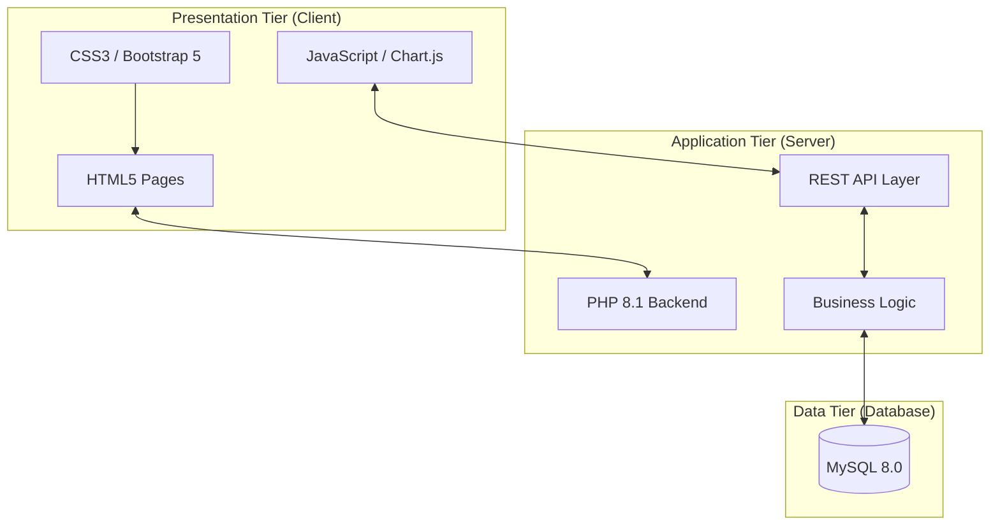

### 4.2 Component Architecture

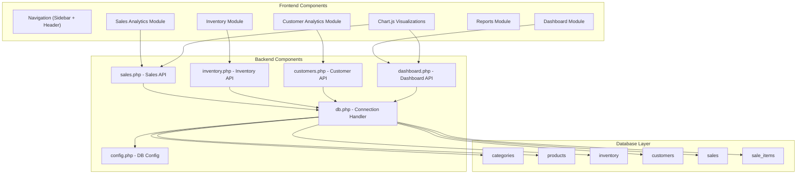

### 4.3 Directory Structure

```
jwellery/
├── index.php                  ← Entry Point
├── assets/                    ← Static Resources
│   ├── css/                   ← Stylesheets
│   ├── js/                    ← JavaScript files
│   └── images/                ← Static images
├── includes/                  ← Shared PHP Components
│   ├── config.php             ← DB Configuration
│   ├── db.php                 ← DB Connection
│   ├── header.php             ← Page Header
│   ├── sidebar.php            ← Navigation Sidebar
│   └── footer.php             ← Page Footer
├── modules/                   ← Feature Modules
│   ├── dashboard/             ← KPI Dashboard
│   ├── sales/                 ← Sales Analytics
│   ├── inventory/             ← Inventory Management
│   ├── customers/             ← Customer Analytics
│   └── reports/               ← Report Generation
├── api/                       ← Backend API Endpoints
│   ├── dashboard.php
│   ├── sales.php
│   ├── inventory.php
│   └── customers.php
└── sql/                       ← Database Scripts
    ├── schema.sql
    └── seed_data.sql
```

---

## 5. Data Flow Diagrams (DFD)

### 5.1 Context Diagram (Level 0 DFD)

The Context Diagram shows the system as a single process with its external entities.

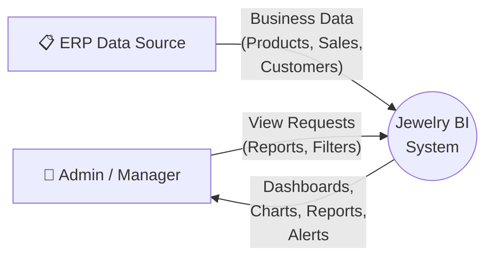

**External Entities:**
- **Admin / Manager:** The primary user who views dashboards, reports, and analytics
- **ERP Data Source:** External system that provides business data via Excel exports

**Data Flows:**
- Business data (products, sales, customers) flows INTO the system
- Dashboards, charts, reports, and alerts flow OUT to the admin

---

### 5.2 Level 1 DFD

Level 1 breaks the system into its major processes.

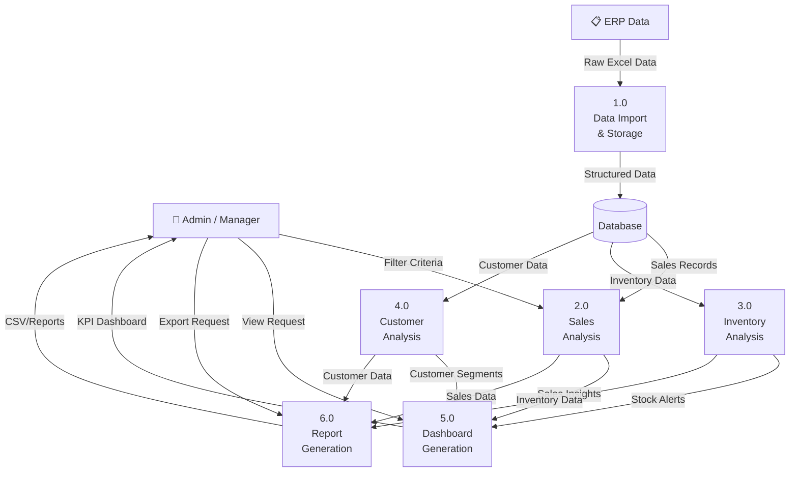

**Processes:**

| Process | Name | Description |
|---------|------|-------------|
| 1.0 | Data Import & Storage | Import Excel data into MySQL database |
| 2.0 | Sales Analysis | Process sales transactions for insights |
| 3.0 | Inventory Analysis | Analyze stock levels, detect dead stock |
| 4.0 | Customer Analysis | Segment customers, calculate CLV |
| 5.0 | Dashboard Generation | Compile KPIs and generate dashboard |
| 6.0 | Report Generation | Generate downloadable reports |

---

### 5.3 Level 2 DFD — Sales Analysis (Process 2.0)

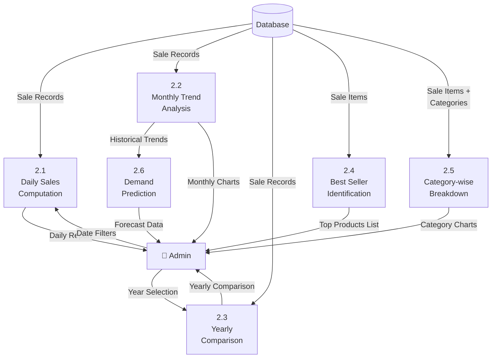

---

### 5.4 Level 2 DFD — Inventory Analysis (Process 3.0)

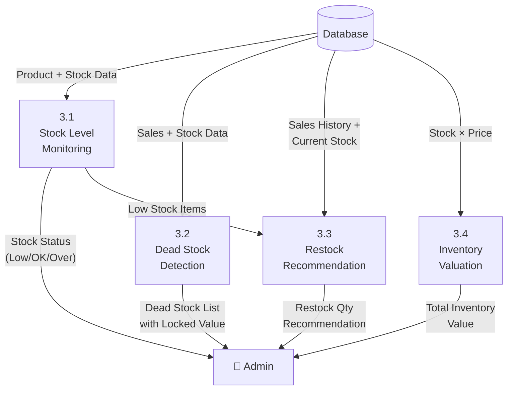

---

## 6. Entity Relationship Diagram

### 6.1 ER Diagram

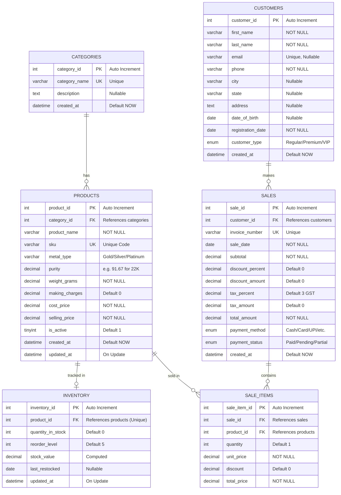

### 6.2 Cardinality Summary

| Relationship | Type | Description |
|-------------|------|-------------|
| Categories → Products | One-to-Many (1:M) | One category has many products |
| Products → Inventory | One-to-One (1:1) | Each product has one inventory record |
| Customers → Sales | One-to-Many (1:M) | One customer can make many purchases |
| Sales → Sale Items | One-to-Many (1:M) | One sale has many line items |
| Products → Sale Items | One-to-Many (1:M) | One product appears in many sale items |

### 6.3 Data Dictionary

#### Table: products

| Attribute | Data Type | Size | Constraint | Description |
|-----------|----------|------|------------|-------------|
| product_id | INT | 11 | Primary Key, Auto Increment | Unique product identifier |
| category_id | INT | 11 | Foreign Key → categories | Product category reference |
| product_name | VARCHAR | 200 | NOT NULL | Display name of product |
| sku | VARCHAR | 50 | UNIQUE, NOT NULL | Stock Keeping Unit code (e.g., CH01, RG29) |
| metal_type | VARCHAR | 50 | NOT NULL | Type: Gold, Silver, Platinum |
| purity | DECIMAL | 5,2 | NULL | Purity percentage (22K = 91.67%) |
| weight_grams | DECIMAL | 10,3 | NOT NULL | Product weight in grams |
| making_charges | DECIMAL | 10,2 | DEFAULT 0 | Manufacturing charges in ₹ |
| cost_price | DECIMAL | 12,2 | NOT NULL | Cost/purchase price in ₹ |
| selling_price | DECIMAL | 12,2 | NOT NULL | Retail selling price in ₹ |
| is_active | TINYINT | 1 | DEFAULT 1 | Active (1) or Inactive (0) |
| created_at | DATETIME | — | DEFAULT CURRENT_TIMESTAMP | Record creation timestamp |
| updated_at | DATETIME | — | ON UPDATE CURRENT_TIMESTAMP | Last modification timestamp |

#### Table: sales

| Attribute | Data Type | Size | Constraint | Description |
|-----------|----------|------|------------|-------------|
| sale_id | INT | 11 | Primary Key, Auto Increment | Unique sale identifier |
| customer_id | INT | 11 | Foreign Key → customers | Buyer reference |
| invoice_number | VARCHAR | 50 | UNIQUE, NOT NULL | Invoice reference (e.g., INV-2024-001) |
| sale_date | DATE | — | NOT NULL | Transaction date |
| subtotal | DECIMAL | 14,2 | NOT NULL | Pre-tax, pre-discount total |
| discount_percent | DECIMAL | 5,2 | DEFAULT 0 | Discount percentage applied |
| discount_amount | DECIMAL | 12,2 | DEFAULT 0 | Discount amount in ₹ |
| tax_percent | DECIMAL | 5,2 | DEFAULT 3.00 | GST rate |
| tax_amount | DECIMAL | 12,2 | DEFAULT 0 | Tax amount in ₹ |
| total_amount | DECIMAL | 14,2 | NOT NULL | Final payable amount in ₹ |
| payment_method | ENUM | — | NOT NULL | Cash / Card / UPI / Bank Transfer / EMI |
| payment_status | ENUM | — | DEFAULT 'Paid' | Paid / Pending / Partial |

---

## 7. Use Case Diagram

### 7.1 System Use Cases

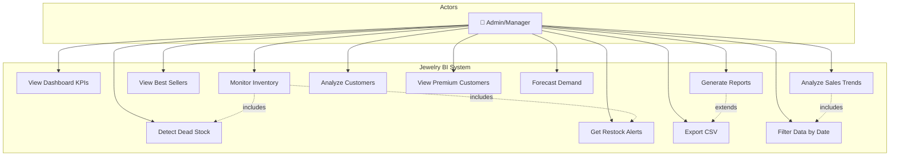

### 7.2 Use Case Descriptions

#### UC-01: View Dashboard KPIs

| Field | Description |
|-------|-------------|
| **Use Case ID** | UC-01 |
| **Name** | View Dashboard KPIs |
| **Actor** | Admin / Manager |
| **Precondition** | Data is imported into database |
| **Main Flow** | 1. User opens the application<br>2. System loads the dashboard page<br>3. System queries database for KPI metrics<br>4. System calculates Total Revenue, Orders, Customers, Profit<br>5. System renders KPI cards and charts<br>6. User views the dashboard |
| **Postcondition** | Dashboard displays current business KPIs |
| **Alternate Flow** | If database is empty, show "No data available" message |

#### UC-05: Detect Dead Stock

| Field | Description |
|-------|-------------|
| **Use Case ID** | UC-05 |
| **Name** | Detect Dead Stock |
| **Actor** | Admin / Manager |
| **Precondition** | Products and sales data exist in database |
| **Main Flow** | 1. User navigates to Inventory → Dead Stock<br>2. System queries products not sold in 90+ days<br>3. System calculates locked inventory value<br>4. System displays dead stock list with last sale date<br>5. User reviews and takes action |
| **Postcondition** | Dead stock products are listed with recommendations |

#### UC-09: Forecast Demand

| Field | Description |
|-------|-------------|
| **Use Case ID** | UC-09 |
| **Name** | Forecast Demand |
| **Actor** | Admin / Manager |
| **Precondition** | At least 3 months of sales data exists |
| **Main Flow** | 1. User navigates to Sales → Forecast<br>2. System retrieves historical monthly sales<br>3. System calculates 3-month moving average<br>4. System projects next 3 months<br>5. System displays forecast chart (actual vs predicted)<br>6. User uses data for inventory planning |
| **Postcondition** | Sales forecast is displayed with predicted values |

---

## 8. Activity Diagrams

### 8.1 Dashboard Loading Activity

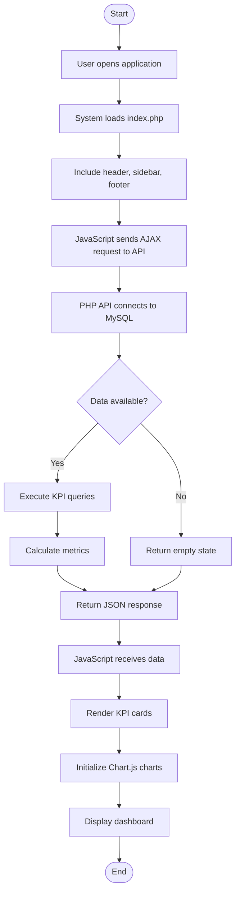

### 8.2 Sales Analysis Activity

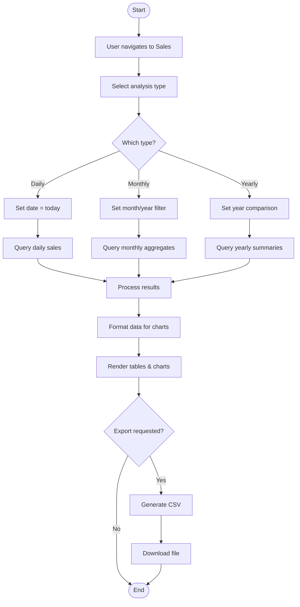

### 8.3 Dead Stock Detection Activity

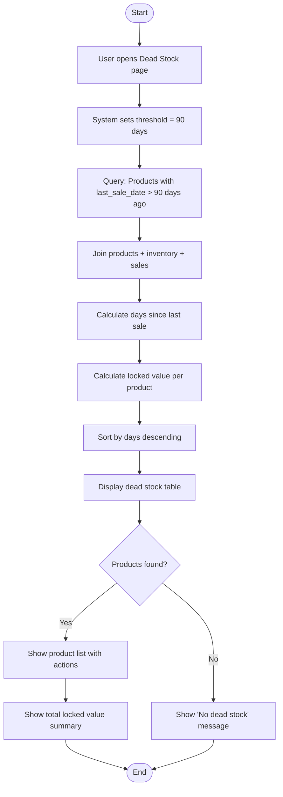

---

## 9. Sequence Diagrams

### 9.1 Dashboard Loading Sequence

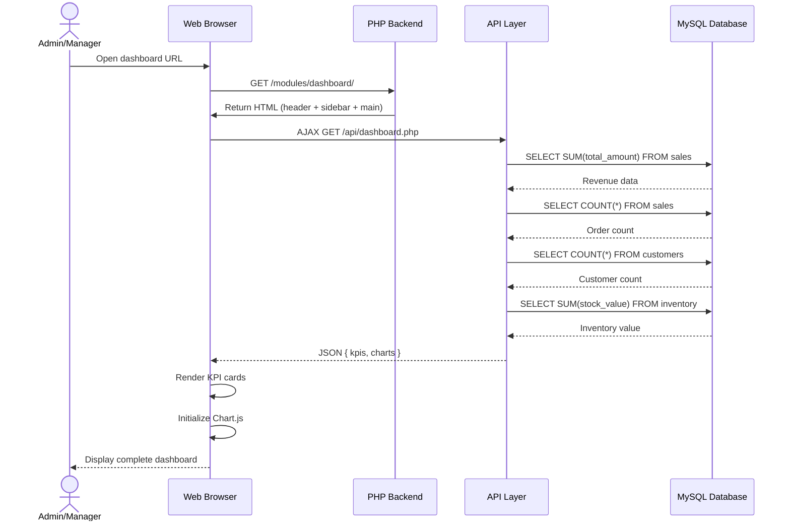

### 9.2 Report Export Sequence

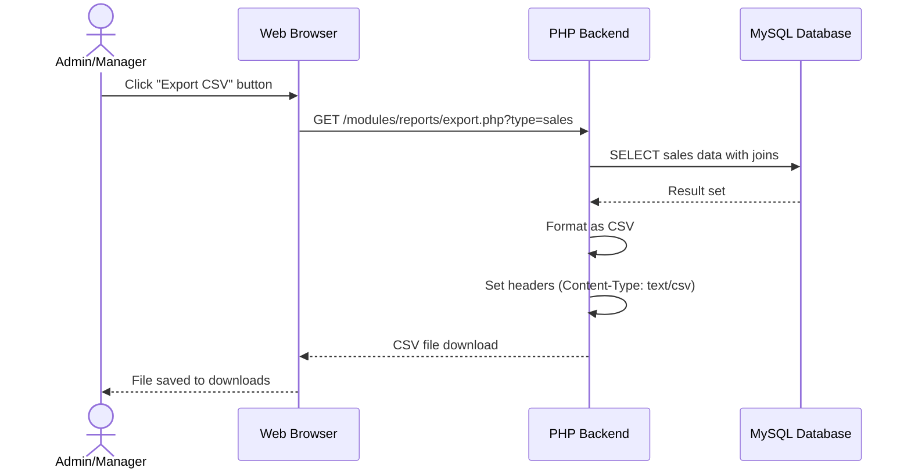

### 9.3 Restock Recommendation Sequence

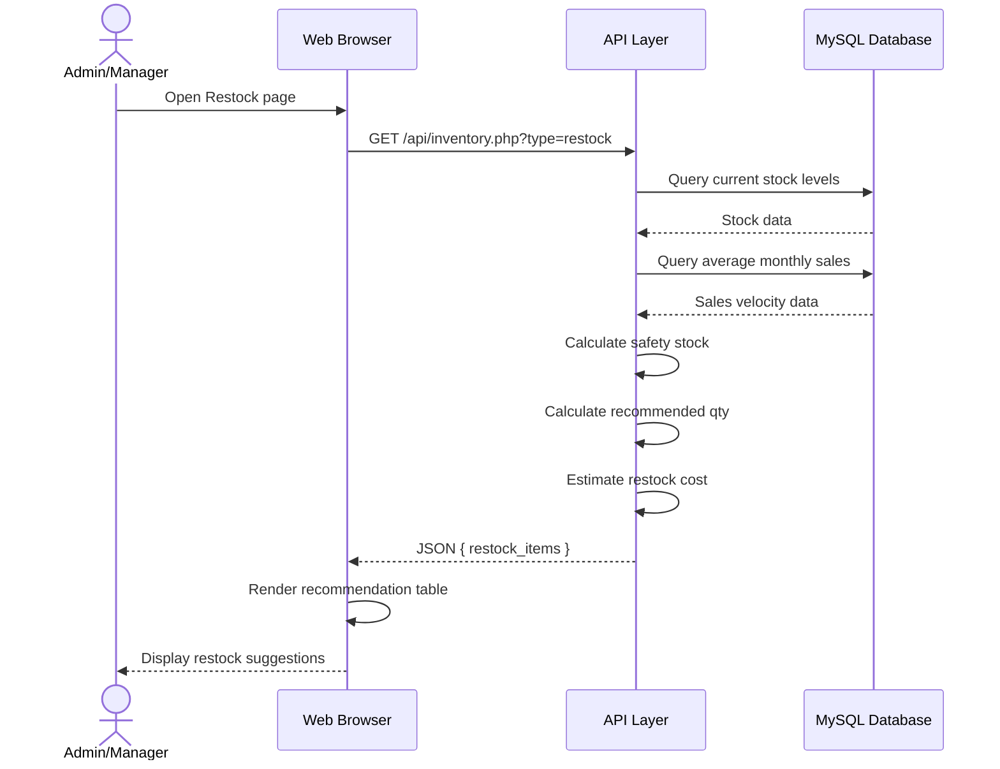

---

## 10. Database Design

### 10.1 Normalization

The database follows **Third Normal Form (3NF)**:

**First Normal Form (1NF):**
- All columns contain atomic (single) values
- Each row is uniquely identified by a primary key
- No repeating groups

**Second Normal Form (2NF):**
- Satisfies 1NF
- All non-key columns depend on the entire primary key
- No partial dependencies (sale_items separated from sales)

**Third Normal Form (3NF):**
- Satisfies 2NF
- No transitive dependencies
- Category details stored in separate `categories` table
- Customer details separated from sales transactions

### 10.2 Table Relationships

| Parent Table | Child Table | Relationship | FK Column |
|-------------|------------|--------------|-----------|
| categories | products | 1:M | category_id |
| products | inventory | 1:1 | product_id |
| customers | sales | 1:M | customer_id |
| sales | sale_items | 1:M | sale_id |
| products | sale_items | 1:M | product_id |

### 10.3 Data Mapping (Excel → Database)

| Source File | Target Table(s) | Mapping |
|-------------|-----------------|---------|
| Dummy_Jewellery_Inventory.xlsx | products, inventory, categories | Product Code → sku, Category → categories.category_name, Purity/Color/Weight → products, Stock derived for inventory |
| Jaipur_Focused_Customer_Report.xlsx | customers | Customer ID → customer_id, Name split → first_name + last_name, City/State/Address direct map |
| Jewellery_Sales_Report_2024_2026_Sorted.xlsx | sales, sale_items | Invoice Date → sale_date, Product Code → product_id (via sku), Sale Value → total_amount, Making Charges direct map |

---

## 11. Input Design

### 11.1 Input Screens

The system primarily receives input through **filter controls** and **navigation** (not data entry forms, since data is imported from ERP).

#### Date Range Filter

| Field | Type | Validation | Default |
|-------|------|-----------|---------|
| Start Date | Date Picker | Must be ≤ End Date | First day of current month |
| End Date | Date Picker | Must be ≥ Start Date | Today |

#### Category Filter

| Field | Type | Options | Default |
|-------|------|---------|---------|
| Category | Dropdown | All categories from DB | "All Categories" |

#### Analysis Type Selector

| Field | Type | Options | Default |
|-------|------|---------|---------|
| View By | Radio/Tabs | Daily / Monthly / Yearly | Monthly |

### 11.2 Input Validation Rules

| Rule | Description |
|------|-------------|
| Date Range | End date cannot be before start date |
| Category | Must be a valid category from database |
| Numeric Filters | Must be positive numbers |
| Search Text | Sanitized to prevent SQL injection |

---

## 12. Output Design

### 12.1 Dashboard Output

```
┌─────────────────────────────────────────────────────────────┐
│  💎 Jewelry Business Intelligence Dashboard                 │
├──────────┬──────────┬──────────┬──────────┬────────────────┤
│ 💰       │ 📦       │ 👥       │ 🏪       │ 📈             │
│ Revenue  │ Orders   │ Customers│ Inv Value│ Growth         │
│ ₹1.54Cr  │ 342      │ 156      │ ₹87.5L   │ +12.5%         │
├──────────┴──────────┴──────────┴──────────┴────────────────┤
│                                                             │
│  Monthly Revenue Trend          Category-wise Sales         │
│  ┌─────────────────┐           ┌─────────────────┐         │
│  │  📈 Line Chart  │           │  🍩 Donut Chart │         │
│  │                 │           │                 │         │
│  └─────────────────┘           └─────────────────┘         │
│                                                             │
│  Recent Sales                   Top Products                │
│  ┌─────────────────┐           ┌─────────────────┐         │
│  │  📋 Data Table  │           │  📊 Bar Chart   │         │
│  │                 │           │                 │         │
│  └─────────────────┘           └─────────────────┘         │
└─────────────────────────────────────────────────────────────┘
```

### 12.2 Report Outputs

| Report Type | Format | Fields |
|-------------|--------|--------|
| Sales Summary | Screen + CSV | Date, Invoice, Customer, Products, Amount |
| Inventory Status | Screen + CSV | Product, Category, Stock, Status, Value |
| Customer Analysis | Screen + CSV | Name, City, Orders, Total Spent, CLV |
| Dead Stock | Screen + CSV | Product, Category, Days Unsold, Locked Value |
| Restock | Screen + CSV | Product, Current Stock, Avg Sales, Recommended Qty |

### 12.3 Chart Outputs

| Chart | Type | X-Axis | Y-Axis | Data Source |
|-------|------|--------|--------|-------------|
| Revenue Trend | Line | Months | Revenue (₹) | sales.total_amount |
| Category Sales | Doughnut | — | % Share | sale_items by category |
| Daily Sales | Area | Days | Revenue (₹) | sales.sale_date |
| Top Products | Horizontal Bar | Products | Revenue (₹) | sale_items aggregate |
| Stock Status | Pie | — | Count | inventory.status |
| Customer Distribution | Bar | Cities | Count | customers.city |

---

## 13. User Interface Design

### 13.1 Layout Design

The application uses a **sidebar navigation layout** common in admin dashboards:

```
┌──────────────────────────────────────────────────────┐
│  HEADER BAR (Logo + Title + User Info)                │
├──────────┬───────────────────────────────────────────┤
│          │                                           │
│ SIDEBAR  │          MAIN CONTENT AREA                │
│          │                                           │
│ Dashboard│  ┌─────────────────────────────────────┐  │
│ Sales    │  │                                     │  │
│ Inventory│  │        KPI Cards / Charts /         │  │
│ Customers│  │        Data Tables                  │  │
│ Reports  │  │                                     │  │
│          │  └─────────────────────────────────────┘  │
│          │                                           │
├──────────┴───────────────────────────────────────────┤
│  FOOTER (Copyright + Version)                        │
└──────────────────────────────────────────────────────┘
```

### 13.2 CSS Strategy: Bootstrap First

> **Rule:** Use Bootstrap 5 classes for EVERYTHING possible. Write custom CSS ONLY when Bootstrap cannot do it.

| Need | Bootstrap? | Custom CSS? |
|------|:-:|:-:|
| Cards, padding, margins, grid | ✅ Bootstrap | ❌ No |
| Tables (striped, hover, responsive) | ✅ Bootstrap | ❌ No |
| Buttons, badges, alerts, colors | ✅ Bootstrap | ❌ No |
| Navbar, dropdowns, modals | ✅ Bootstrap | ❌ No |
| Text sizes, font weights, spacing | ✅ Bootstrap | ❌ No |
| Sidebar width & transitions | ❌ Not in Bootstrap | ✅ custom.css |
| Chart container sizing | ❌ Not in Bootstrap | ✅ custom.css |
| Custom scrollbar, glassmorphism | ❌ Not in Bootstrap | ✅ custom.css |

**CSS Files (only 2 files):**
- `variables.css` — Theme CSS custom properties (~30 lines)
- `custom.css` — Only what Bootstrap can't do (~100-150 lines max)

For full coding standards, see `CODING_STANDARDS.md`.

### 13.3 Color Scheme (via Bootstrap + CSS Variables)

| Element | Color | Hex Code | Usage |
|---------|-------|----------|-------|
| Primary | Indigo | `#6366f1` | Buttons, active links, accents |
| Secondary | Slate | `#475569` | Text, borders |
| Success | Emerald | `#22c55e` | Positive metrics, stock OK |
| Warning | Amber | `#f59e0b` | Low stock alerts, caution |
| Danger | Red | `#ef4444` | Out of stock, negative trends |
| Background | Dark Slate | `#0f172a` | Page background (dark mode) |
| Surface | Dark Blue | `#1e293b` | Card backgrounds |
| Text Primary | White | `#f8fafc` | Main text |
| Text Muted | Gray | `#94a3b8` | Secondary text |

### 13.4 Typography (Google Fonts: Inter)

| Element | Bootstrap Class | Size |
|---------|----------------|------|
| Page Title | `.h3 .fw-bold` | 24px |
| Section Title | `.h5 .fw-semibold` | 20px |
| Body Text | Default | 16px |
| KPI Values | `.display-6 .fw-bold` | 28-36px |
| Labels | `.small .text-muted .text-uppercase` | 12-13px |
| Table Data | Default `.table` | 14px |

### 13.5 Component Specifications

#### KPI Card (100% Bootstrap classes)

```html
<div class="card border-0 shadow-sm rounded-3 h-100">
  <div class="card-body p-4">
    <div class="d-flex align-items-center mb-3">
      <div class="bg-primary bg-opacity-10 rounded-3 p-2 me-3">
        <i class="bi bi-currency-rupee text-primary fs-4"></i>
      </div>
      <span class="text-muted fw-semibold small text-uppercase">Revenue</span>
    </div>
    <h3 class="fw-bold mb-1">₹1,54,20,000</h3>
    <span class="badge bg-success-subtle text-success">▲ 12.5%</span>
  </div>
</div>
```

#### Navigation Sidebar (Bootstrap Offcanvas + Nav)

Uses Bootstrap's `nav-pills`, `list-group`, and responsive collapse.
Only custom CSS needed: fixed width (260px/70px) and transition.

### 13.5 Responsive Breakpoints

| Breakpoint | Width | Layout Changes |
|-----------|-------|---------------|
| Desktop | ≥ 1200px | Full sidebar + 4-column KPI grid |
| Tablet | 768px – 1199px | Collapsed sidebar + 2-column grid |
| Mobile | < 768px | Hidden sidebar (hamburger menu) + 1-column |

---

## 14. Security Design

### 14.1 Security Measures

| Threat | Mitigation |
|--------|-----------|
| SQL Injection | Use PDO Prepared Statements for all queries |
| XSS (Cross-Site Scripting) | Sanitize all output with `htmlspecialchars()` |
| CSRF | Not applicable (read-only dashboard, no form submissions) |
| Direct File Access | Restrict access to `includes/` via `.htaccess` |
| Database Credentials | Store in `config.php` outside web root or use environment variables |

### 14.2 PHP Security Practices

```php
// ✅ CORRECT: Using Prepared Statements
$stmt = $pdo->prepare("SELECT * FROM products WHERE category_id = ?");
$stmt->execute([$category_id]);

// ❌ WRONG: Direct variable interpolation
$result = $pdo->query("SELECT * FROM products WHERE category_id = $id");

// ✅ CORRECT: Output sanitization
echo htmlspecialchars($product_name, ENT_QUOTES, 'UTF-8');
```

---

## 15. Testing Strategy

### 15.1 Testing Levels

| Level | Scope | Method |
|-------|-------|--------|
| Unit Testing | Individual PHP functions | Manual test with sample data |
| Integration Testing | API endpoints + Database | Test API responses via browser/Postman |
| System Testing | Complete application flow | End-to-end scenario testing |
| UI Testing | Visual correctness | Cross-browser testing |
| Performance Testing | Load time & response time | Browser DevTools |

### 15.2 Test Cases

| Test ID | Module | Test Case | Expected Result | Status |
|---------|--------|-----------|-----------------|--------|
| TC-01 | Dashboard | Load dashboard page | KPIs display within 3 seconds | ⬜ |
| TC-02 | Dashboard | Verify revenue calculation | Matches SUM of sales.total_amount | ⬜ |
| TC-03 | Sales | Filter by date range | Only filtered data displayed | ⬜ |
| TC-04 | Sales | View monthly trend chart | Line chart renders correctly | ⬜ |
| TC-05 | Inventory | Check low stock alert | Products with stock ≤ reorder_level shown | ⬜ |
| TC-06 | Inventory | Dead stock detection | Products unsold 90+ days listed | ⬜ |
| TC-07 | Inventory | Restock recommendation | Recommended qty is calculated correctly | ⬜ |
| TC-08 | Customers | Customer segmentation | Segments match spending criteria | ⬜ |
| TC-09 | Customers | CLV calculation | CLV = AOV × Frequency × Lifespan | ⬜ |
| TC-10 | Reports | Export CSV | Valid CSV file downloads | ⬜ |
| TC-11 | UI | Responsive layout | Works on 1920px, 1366px, 768px, 375px | ⬜ |
| TC-12 | Security | SQL injection attempt | Query is sanitized, no error | ⬜ |

### 15.3 Browser Compatibility

| Browser | Version | Status |
|---------|---------|--------|
| Google Chrome | 90+ | ⬜ To Test |
| Mozilla Firefox | 88+ | ⬜ To Test |
| Microsoft Edge | 90+ | ⬜ To Test |
| Safari | 14+ | ⬜ To Test |

---

## 📎 Appendix

### A. Abbreviations

| Abbreviation | Full Form |
|-------------|-----------|
| BI | Business Intelligence |
| ERP | Enterprise Resource Planning |
| KPI | Key Performance Indicator |
| DFD | Data Flow Diagram |
| ER | Entity Relationship |
| CLV | Customer Lifetime Value |
| AOV | Average Order Value |
| GST | Goods and Services Tax |
| CSV | Comma Separated Values |
| API | Application Programming Interface |
| AJAX | Asynchronous JavaScript and XML |
| PDO | PHP Data Objects |
| SQL | Structured Query Language |
| CRUD | Create, Read, Update, Delete |
| UI | User Interface |
| UX | User Experience |

### B. References

1. Pressman, R. S. — *Software Engineering: A Practitioner's Approach*
2. Elmasri, R. & Navathe, S. B. — *Fundamentals of Database Systems*
3. Chart.js Documentation — https://www.chartjs.org/docs/
4. Bootstrap 5 Documentation — https://getbootstrap.com/docs/5.3/
5. PHP Official Documentation — https://www.php.net/docs.php
6. MySQL Reference Manual — https://dev.mysql.com/doc/
7. DDEV Documentation — https://ddev.readthedocs.io/
