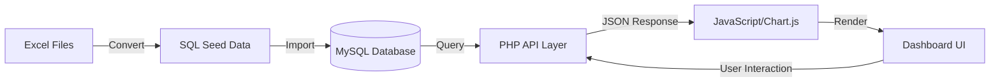

# 📦 Modules Documentation — Jewelry Business Intelligence System

> Detailed documentation for each module including features, API endpoints, database queries, and UI components.

---

## 📋 Module Overview

| # | Module | Route | Priority | Description |
|---|--------|-------|----------|-------------|
| 1 | [Dashboard](#1-business-dashboard) | `/modules/dashboard/` | 🔴 High | Real-time KPI overview |
| 2 | [Sales Analytics](#2-sales-analytics) | `/modules/sales/` | 🔴 High | Sales trends & analysis |
| 3 | [Inventory Intelligence](#3-inventory-intelligence) | `/modules/inventory/` | 🔴 High | Stock management & alerts |
| 4 | [Customer Analytics](#4-customer-analytics) | `/modules/customers/` | 🟡 Medium | Customer behavior analysis |
| 5 | [Demand Prediction](#5-demand-prediction) | `/modules/sales/` | 🟡 Medium | Sales forecasting |
| 6 | [Dead Stock Detection](#6-dead-stock-detection) | `/modules/inventory/deadstock.php` | 🟡 Medium | Unsold product identification |
| 7 | [Restock Recommendations](#7-restock-recommendations) | `/modules/inventory/restock.php` | 🟢 Low | Replenishment suggestions |
| 8 | [Reports & Export](#8-reports--export) | `/modules/reports/` | 🟢 Low | Report generation |

---

## 1. Business Dashboard

**Route:** `modules/dashboard/index.php`

### KPI Cards

The main dashboard displays key performance indicators at a glance:

| KPI | Calculation | Icon |
|-----|-------------|------|
| Total Revenue | `SUM(sales.total_amount)` | 💰 |
| Total Orders | `COUNT(sales.sale_id)` | 📦 |
| Total Customers | `COUNT(DISTINCT customers.customer_id)` | 👥 |
| Inventory Value | `SUM(inventory.stock_value)` | 🏪 |
| Gross Profit | `Revenue - SUM(cost_price × qty_sold)` | 📈 |
| Monthly Growth | `((current_month - previous_month) / previous_month) × 100` | 📊 |

### Charts

| Chart Type | Data | Library |
|------------|------|---------|
| Line Chart | Monthly revenue trend (12 months) | Chart.js |
| Bar Chart | Category-wise sales breakdown | Chart.js |
| Doughnut Chart | Payment method distribution | Chart.js |
| Area Chart | Daily sales for current month | Chart.js |

### API Endpoint

**`GET /api/dashboard.php`**

Returns all dashboard KPIs and chart data as JSON.

```json
{
  "kpis": {
    "total_revenue": 15420000,
    "total_orders": 342,
    "total_customers": 156,
    "inventory_value": 8750000,
    "gross_profit": 4250000,
    "monthly_growth": 12.5
  },
  "charts": {
    "monthly_revenue": [...],
    "category_sales": [...],
    "payment_methods": [...]
  }
}
```

---

## 2. Sales Analytics

**Route:** `modules/sales/`

### Pages

| Page | File | Description |
|------|------|-------------|
| Sales Overview | `index.php` | Summary with top-level metrics |
| Daily Sales | `daily.php` | Day-by-day analysis with calendar view |
| Monthly Trends | `monthly.php` | Month-over-month comparison |
| Yearly Performance | `yearly.php` | Year-on-year analysis (2024-2026) |

### Features

#### Daily Sales Analysis
- **Calendar heatmap** showing daily revenue intensity
- Top products sold each day
- Comparison with previous day

#### Monthly Revenue Trends
- **Line chart** showing 12-month revenue trend
- Average order value per month
- Order count per month
- Growth percentage calculation

#### Yearly Performance Comparison
- **Bar chart** comparing yearly revenue (2024 vs 2025 vs 2026)
- Year-over-year growth metrics
- Quarterly breakdowns

#### Best Selling Products
- **Ranked table** of products by revenue/quantity
- Filterable by category, metal type, date range
- Revenue contribution percentage

#### Category-wise Sales
- **Pie/Doughnut chart** of sales by category
- Revenue and quantity breakdown
- Trend analysis per category

### Key SQL Queries

```sql
-- Monthly Revenue Trend
SELECT 
    DATE_FORMAT(sale_date, '%Y-%m') AS month,
    COUNT(*) AS total_orders,
    SUM(total_amount) AS revenue,
    AVG(total_amount) AS avg_order_value
FROM sales
GROUP BY DATE_FORMAT(sale_date, '%Y-%m')
ORDER BY month;

-- Best Selling Products
SELECT 
    p.product_name,
    c.category_name,
    SUM(si.quantity) AS units_sold,
    SUM(si.total_price) AS total_revenue
FROM sale_items si
JOIN products p ON si.product_id = p.product_id
JOIN categories c ON p.category_id = c.category_id
GROUP BY p.product_id
ORDER BY total_revenue DESC
LIMIT 10;
```

### API Endpoint

**`GET /api/sales.php?type=monthly&year=2025`**

---

## 3. Inventory Intelligence

**Route:** `modules/inventory/`

### Pages

| Page | File | Description |
|------|------|-------------|
| Inventory Overview | `index.php` | Stock levels & valuation |
| Dead Stock | `deadstock.php` | Products not sold in 90+ days |
| Restock | `restock.php` | Replenishment recommendations |

### Features

#### Current Stock Overview
- **Data table** with all products and stock levels
- Color-coded status: 🟢 In Stock, 🟡 Low Stock, 🔴 Out of Stock
- Sortable by quantity, value, category
- Search/filter functionality

#### Inventory Valuation
- Total inventory value (cost & selling price)
- Category-wise inventory distribution (**pie chart**)
- Metal-type wise distribution

#### Low Stock Alerts
- Products where `quantity_in_stock <= reorder_level`
- Sorted by urgency (lowest stock first)
- Alert badges on dashboard

#### Product Movement Analysis
- Fast-moving vs slow-moving products
- Monthly movement trends
- **Bar chart** of movement categories

### Key SQL Queries

```sql
-- Inventory Status Overview
SELECT 
    p.product_name,
    c.category_name,
    p.metal_type,
    i.quantity_in_stock,
    i.reorder_level,
    p.selling_price,
    (i.quantity_in_stock * p.selling_price) AS stock_value,
    CASE 
        WHEN i.quantity_in_stock = 0 THEN 'Out of Stock'
        WHEN i.quantity_in_stock <= i.reorder_level THEN 'Low Stock'
        WHEN i.quantity_in_stock > i.reorder_level * 5 THEN 'Overstock'
        ELSE 'In Stock'
    END AS stock_status
FROM inventory i
JOIN products p ON i.product_id = p.product_id
JOIN categories c ON p.category_id = c.category_id
ORDER BY i.quantity_in_stock ASC;

-- Category-wise Inventory Distribution
SELECT 
    c.category_name,
    COUNT(p.product_id) AS product_count,
    SUM(i.quantity_in_stock) AS total_stock,
    SUM(i.quantity_in_stock * p.selling_price) AS total_value
FROM categories c
JOIN products p ON c.category_id = p.category_id
JOIN inventory i ON p.product_id = i.product_id
GROUP BY c.category_id;
```

### API Endpoint

**`GET /api/inventory.php?status=low_stock`**

---

## 4. Customer Analytics

**Route:** `modules/customers/`

### Pages

| Page | File | Description |
|------|------|-------------|
| Customer Overview | `index.php` | Summary metrics & list |
| Segments | `segments.php` | Customer segmentation |
| Premium Customers | `premium.php` | High-value customer analysis |

### Features

#### Customer Segmentation
- Segment by purchase frequency & value
- Categories: **VIP**, **Premium**, **Regular**, **Inactive**
- **Doughnut chart** of segment distribution

#### Premium Customer Identification
- Top customers by total spend
- Ranked table with lifetime value
- Purchase frequency & recency

#### Customer Lifetime Value (CLV)
- `CLV = Average Order Value × Purchase Frequency × Customer Lifespan`
- **Bar chart** of top 10 customers by CLV

#### Purchase Frequency Analysis
- Average days between purchases
- Repeat purchase rate percentage
- **Histogram** of purchase frequencies

#### Geographic Distribution
- Customer count by city/state
- **Bar chart** of top cities (focused on Jaipur)

### Key SQL Queries

```sql
-- Customer Lifetime Value
SELECT 
    c.customer_id,
    CONCAT(c.first_name, ' ', c.last_name) AS customer_name,
    c.city,
    c.customer_type,
    COUNT(s.sale_id) AS total_orders,
    SUM(s.total_amount) AS total_spent,
    AVG(s.total_amount) AS avg_order_value,
    MIN(s.sale_date) AS first_purchase,
    MAX(s.sale_date) AS last_purchase,
    DATEDIFF(MAX(s.sale_date), MIN(s.sale_date)) AS customer_lifespan_days
FROM customers c
LEFT JOIN sales s ON c.customer_id = s.customer_id
GROUP BY c.customer_id
ORDER BY total_spent DESC;

-- Geographic Distribution
SELECT 
    c.city,
    COUNT(DISTINCT c.customer_id) AS customer_count,
    SUM(s.total_amount) AS city_revenue
FROM customers c
LEFT JOIN sales s ON c.customer_id = s.customer_id
GROUP BY c.city
ORDER BY customer_count DESC;
```

### API Endpoint

**`GET /api/customers.php?type=segments`**

---

## 5. Demand Prediction

**Route:** Integrated into `modules/sales/` pages

### Method: Moving Average + Growth Rate Analysis

Since this is a BCA-level project, we use statistical methods instead of ML:

#### Moving Average (3-Month)

```php
// Calculate 3-month moving average for demand prediction
function calculateMovingAverage($salesData, $periods = 3) {
    $predictions = [];
    for ($i = $periods; $i < count($salesData); $i++) {
        $sum = 0;
        for ($j = $i - $periods; $j < $i; $j++) {
            $sum += $salesData[$j]['revenue'];
        }
        $predictions[] = $sum / $periods;
    }
    return $predictions;
}
```

#### Growth Rate Analysis

```php
// Monthly growth rate
function calculateGrowthRate($currentMonth, $previousMonth) {
    if ($previousMonth == 0) return 0;
    return (($currentMonth - $previousMonth) / $previousMonth) * 100;
}
```

### Features

- **Forecast next 3 months** based on moving average
- **Seasonal trend identification** (wedding season, festivals)
- **Product demand estimation** based on historical sales velocity
- **Line chart** showing actual vs predicted sales

---

## 6. Dead Stock Detection

**Route:** `modules/inventory/deadstock.php`

### Definition
Products not sold in the last **90 days** (configurable).

### Features

- List of dead stock products with last sale date
- Days since last sale
- Stock value locked in dead inventory
- **Recommendation actions:** Discount, Bundle, Remove

### Key SQL Query

```sql
-- Dead Stock Detection (not sold in 90+ days)
SELECT 
    p.product_id,
    p.product_name,
    p.metal_type,
    c.category_name,
    i.quantity_in_stock,
    p.selling_price,
    (i.quantity_in_stock * p.selling_price) AS locked_value,
    MAX(s.sale_date) AS last_sold_date,
    DATEDIFF(CURDATE(), MAX(s.sale_date)) AS days_since_last_sale
FROM products p
JOIN inventory i ON p.product_id = i.product_id
JOIN categories c ON p.category_id = c.category_id
LEFT JOIN sale_items si ON p.product_id = si.product_id
LEFT JOIN sales s ON si.sale_id = s.sale_id
GROUP BY p.product_id
HAVING last_sold_date IS NULL 
    OR DATEDIFF(CURDATE(), last_sold_date) > 90
ORDER BY days_since_last_sale DESC;
```

---

## 7. Restock Recommendations

**Route:** `modules/inventory/restock.php`

### Algorithm

```
Recommended Restock Qty = (Avg Monthly Sales × Lead Time Months) + Safety Stock - Current Stock

Where:
- Avg Monthly Sales = Total units sold / Number of months
- Lead Time = 1 month (default for jewelry)
- Safety Stock = Avg Monthly Sales × 0.5 (50% buffer)
```

### Features

- Products needing restock (current stock ≤ reorder level)
- Recommended order quantity
- Estimated cost of restock
- Priority ranking (most urgent first)
- **Data table** with export option

### Key SQL Query

```sql
-- Restock Recommendations
SELECT 
    p.product_id,
    p.product_name,
    p.cost_price,
    i.quantity_in_stock,
    i.reorder_level,
    COALESCE(
        SUM(si.quantity) / 
        GREATEST(TIMESTAMPDIFF(MONTH, MIN(s.sale_date), CURDATE()), 1),
        0
    ) AS avg_monthly_sales,
    GREATEST(
        CEIL(
            COALESCE(SUM(si.quantity) / GREATEST(TIMESTAMPDIFF(MONTH, MIN(s.sale_date), CURDATE()), 1), 0) * 1.5
        ) - i.quantity_in_stock,
        0
    ) AS recommended_qty
FROM products p
JOIN inventory i ON p.product_id = i.product_id
LEFT JOIN sale_items si ON p.product_id = si.product_id
LEFT JOIN sales s ON si.sale_id = s.sale_id
WHERE i.quantity_in_stock <= i.reorder_level
GROUP BY p.product_id
HAVING recommended_qty > 0
ORDER BY recommended_qty DESC;
```

---

## 8. Reports & Export

**Route:** `modules/reports/`

### Report Types

| Report | Description | Format |
|--------|-------------|--------|
| Sales Summary | Monthly/yearly sales report | CSV, Screen |
| Inventory Status | Current stock with status flags | CSV, Screen |
| Customer Report | Customer list with purchase stats | CSV, Screen |
| Dead Stock Report | Non-moving inventory | CSV, Screen |
| Restock Report | Replenishment recommendations | CSV, Screen |

### Export Functionality

```php
// CSV Export
function exportCSV($data, $filename) {
    header('Content-Type: text/csv');
    header('Content-Disposition: attachment; filename="' . $filename . '"');
    
    $output = fopen('php://output', 'w');
    
    // Headers
    fputcsv($output, array_keys($data[0]));
    
    // Data rows
    foreach ($data as $row) {
        fputcsv($output, $row);
    }
    
    fclose($output);
    exit;
}
```

---

## 🎨 UI Components

### Shared Components

| Component | File | Description |
|-----------|------|-------------|
| Header | `includes/header.php` | Top navigation bar with app title |
| Sidebar | `includes/sidebar.php` | Left navigation with module links |
| Footer | `includes/footer.php` | Copyright & version info |
| KPI Card | CSS class `.kpi-card` | Reusable metric display card |
| Data Table | CSS class `.data-table` | Sortable, filterable table |
| Chart Container | CSS class `.chart-container` | Responsive chart wrapper |

### Chart Color Palette

```javascript
const chartColors = {
    primary: '#6366f1',    // Indigo
    success: '#22c55e',    // Green
    warning: '#f59e0b',    // Amber
    danger: '#ef4444',     // Red
    info: '#06b6d4',       // Cyan
    purple: '#a855f7',     // Purple
    pink: '#ec4899',       // Pink
    orange: '#f97316',     // Orange
    gradient: ['#6366f1', '#8b5cf6', '#a855f7', '#c084fc']
};
```

---

## 🔄 Data Flow


